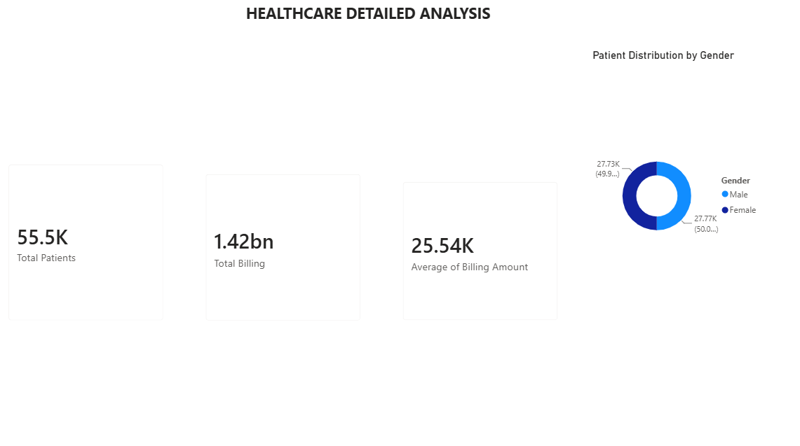
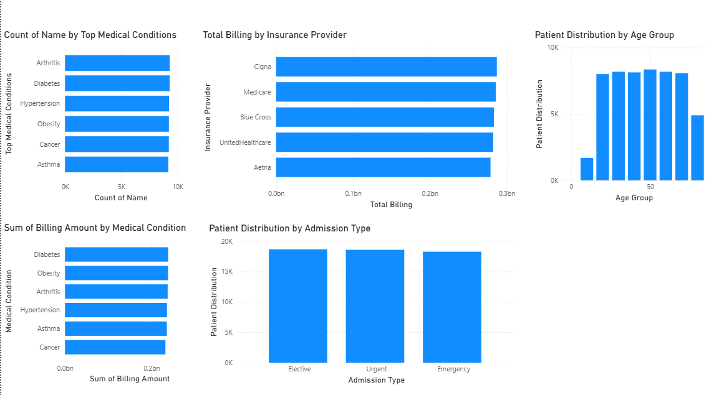

# Healthcare Power BI Dashboard

## Project Overview
Developed an interactive Healthcare Analytics dashboard in Microsoft Power BI to analyze patient demographics, healthcare utilization, insurance billing, and operational performance. The dashboard enables stakeholders to monitor key performance indicators (KPIs) and identify trends for data-driven decision-making.

## Dashboard Preview

### Executive Dashboard

### Healthcare Insights Dashboard

## Key Performance Indicators (KPIs)

- Total Patients: 55.5K
- Total Billing: $1.42B
- Average Billing Amount: $25.54K

## Tools & Technologies

- Microsoft Power BI
- Power Query
- DAX
- Microsoft Excel
- Data Modeling
- Data Visualization

## Skills Demonstrated

- Dashboard Development
- Healthcare Analytics
- KPI Reporting
- Data Cleaning & Transformation
- Data Modeling
- DAX Measures
- Business Intelligence
- Interactive Data Visualization

## Business Insights

- Analyzed patient demographics by age and gender.
- Evaluated billing performance across insurance providers.
- Compared admission types and patient distribution.
- Identified trends across common medical conditions.
- Built an interactive dashboard to support data-driven decision-making.

## Files Included

- Healthcare datasets.pbix
- Dashboard_Overview_Page1.png
- Dashboard_Overview_Page2.png

## Author

Victor Babalola
